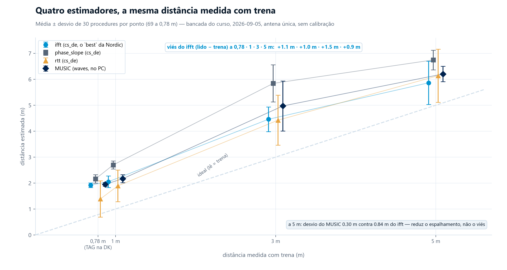
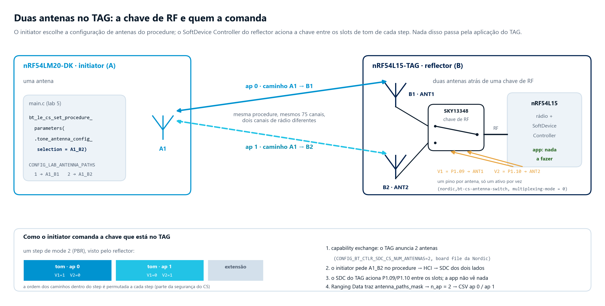
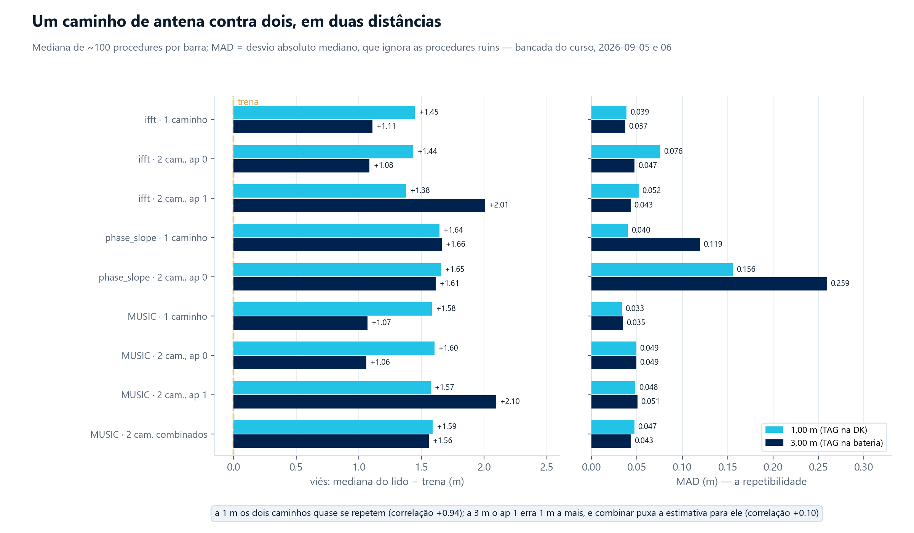
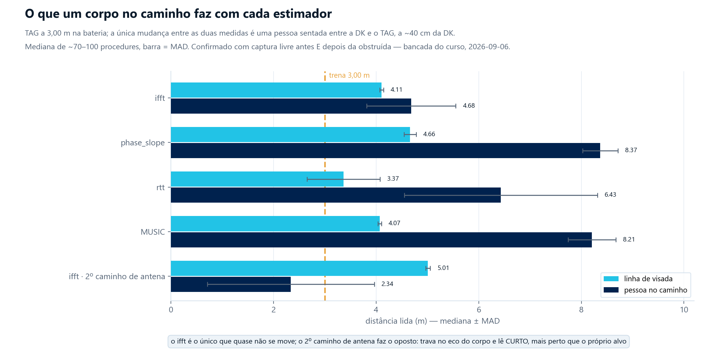

# Channel Sounding · Lab 5 — O IQ no PC: reproduzir o chip e tentar um algoritmo melhor

A Nordic diz, com todas as letras, que o algoritmo do `ras_initiator` é referência:
*"provided just as reference algorithms — we recommend you to work with a third party
algorithm partner if you require more sophisticated algorithms."* O que ela **não** diz é
que o algoritmo vem em fonte — `subsys/bluetooth/cs_de/cs_de.c`, 328 linhas — e que o
IQ cru está numa estrutura que o próprio sample monta. Este lab tira o IQ do chip e
faz duas coisas com ele no PC:

1. **Reproduz o número do firmware** com o mesmo algoritmo, em NumPy. *Entendi o que o
   chip faz?*
2. **Roda um algoritmo de super-resolução** (MUSIC) sobre o mesmo IQ. *O que muda?*

O ganho é **medido, não prometido**. E a medida ensinou uma coisa acima de todas:
o **firmware fornece os dados; a distância é decisão do algoritmo**. O mesmo IQ, do
mesmo chip, a 5 m de trena, deu de **5,6 a 10,7 m** conforme o algoritmo e o caminho
de antena que o PC escolheu. As tabelas no fim mostram cada passo disso.

> **Origem.** Firmware: cópia do `ras_initiator` do **nRF Connect SDK v3.4.0** via o
> lab 2, com uma divergência a mais (`csv_dump_report()`), marcada em `src/main.c`.
> Python: `tools/cs_de_numpy.py` é reimplementação do `cs_de.c` da Nordic (código do
> curso); `tools/music/` é cópia do projeto **skig/waves** (MIT) — ver
> [`tools/music/ORIGEM.md`](tools/music/ORIGEM.md).

## Hardware

| Peça | Papel |
|---|---|
| **nRF54L15-TAG** | reflector RAS do lab 1, na bateria |
| **nRF54LM20-DK** | initiator que, além de medir, despeja o IQ na serial USB |
| **PC** | Python 3.11 com `numpy`, `pyserial`, `pytest` |

## Passo 1 — o firmware

O mesmo `meu_tag.conf` dos labs 2 e 3. TAG fora do `DEBUG OUT`.

```
copy ..\02_cs_initiator\meu_tag.conf meu_tag.conf
cd C:\ncs\v3.4.0
nrfutil sdk-manager toolchain launch --ncs-version v3.4.0 -- west build -p -b nrf54lm20dk/nrf54lm20b/cpuapp --sysbuild -d C:/work/nrf-manaus-2/comms/05_cs_iq_music/build_lm20 C:/work/nrf-manaus-2/comms/05_cs_iq_music -- -DEXTRA_CONF_FILE=meu_tag.conf
nrfutil sdk-manager toolchain launch --ncs-version v3.4.0 -- west flash -d C:/work/nrf-manaus-2/comms/05_cs_iq_music/build_lm20
```

O que sai na serial (115200 8N1), por procedure — 75 linhas `IQ` e uma `CS`:

```
IQ,42,0,2,-812.0,455.0,301.0,-903.0
IQ,42,0,3,-799.0,480.0,318.0,-897.0
...
CS,42,0,1,1.023,1.087,1.349,12,180
   │  │ │   │     │     │    │  └─ rtt acumulado (meias-ns), como o cs_de recebe
   │  │ │   │     │     │    └──── quantos steps de RTT entraram
   │  │ │   │     │     └───────── rtt (m)          ┐
   │  │ │   │     └─────────────── phase_slope (m)  ├ o que o FIRMWARE calculou
   │  │ │   └───────────────────── ifft (m)         ┘
   │  │ └───────────────────────── tone quality (1 = OK)
   │  └─────────────────────────── antenna path
   └────────────────────────────── ranging counter
```

O firmware roda a **1 procedure/s de propósito**: cada procedure é ~2,7 kB de CSV, e
a 115200 8N1 (~11,5 kB/s úteis) o teto é ~4 procedures/s — menos que o default do
sample. O botão é `CONFIG_LAB_PROCEDURE_INTERVAL` (`prj.conf` já traz `=50`, 1 s).

O log do sample (`Filtrando pelo tag`, `CS procedures enabled`, ...) vai para o
**RTT**, não para a serial — senão intercalaria com o CSV. Se precisar dele,
`JLinkRTTLogger -Device CORTEX-M33 -RTTSearchRanges "0x20000000 0x80000" -USB <serial da DK>`.

## Passo 2 — o ambiente Python

```
cd tools
python -m pip install -r requirements.txt
python -m pytest -q          # 20 passed: o port e o adaptador batem com IQ sintetico
```

## Passo 3 — capturar

```
python cs_capture.py --seconds 30 --out ../capturas/1m.csv
```

Acha a porta sozinho, mostra a taxa e a última estimativa, e guarda só as linhas
válidas. Repita para 3 m e 5 m, com trena. `capturas/` não é versionada.

O `cs_capture.py` ativa o DTR ao abrir a porta: a serial USB da LM20-DK só fala com
o VCOM se o DTR estiver ligado. Se você abrir a mesma COM num terminal próprio
(PuTTY, `screen`, etc.) e não ver nada, é essa a causa — ative o DTR do lado do
terminal.

## Passo 4 — comparar

> O firmware sai por default com **dois caminhos de antena** (`CONFIG_LAB_ANTENNA_PATHS=2`),
> então cada procedure aparece duas vezes no CSV (`ap 0` e `ap 1`) e a tabela abaixo tem
> as colunas de `ap 1`, das combinações e das regras de escolha. Com `=1` elas ficam NaN e
> somem do resumo.

```
python cs_compare.py ../capturas/1m.csv
```

```
counter tq  ifft_fw  ifft_np   d_ifft    ps_fw    ps_np   rtt_fw   rtt_np    music
     42  1    1.023    1.021   -0.002    1.087    1.087    1.349    1.349     0.98
...
 estimador    media   desvio    n
   ifft_fw    x.xxx    x.xxx   nn
     ps_fw    x.xxx    x.xxx   nn
    rtt_fw    x.xxx    x.xxx   nn
     music    x.xxx    x.xxx   nn
```

Três colunas para olhar primeiro:

- **`d_ifft`** — NumPy menos firmware. Tem que ser ~0 (o chip calcula em float32).
  Se não for, o port não reproduz o chip, e nada do resto vale.
- **`rtt_np` = `rtt_fw`** a três casas: é uma média, não há o que divergir.
- **`music`** — o mesmo IQ, outro algoritmo. Compare média **e desvio** com `ifft_fw`.

## Sem hardware? Use o dataset de referência

[`dataset_referencia/`](dataset_referencia/) traz as quatro capturas reais que geraram a
tabela no fim deste README (1, 3 e 5 m com trena, mais a montagem de bancada a 0,78 m).
O `cs_compare.py` roda nelas do mesmo jeito:

```
python cs_compare.py ../dataset_referencia/ref_3m.csv
```

## Passo 5 — ler o algoritmo

Abra `tools/cs_de_numpy.py` e `C:\ncs\v3.4.0\nrf\subsys\bluetooth\cs_de\cs_de.c`
lado a lado. Cada função do Python tem no docstring o nome da função C que reproduz:

| C (`cs_de.c`) | Python | O que faz |
|---|---|---|
| `cs_de_combined_iq_calculate` | `combine` | produto complexo local × remoto: soma as fases da ida e da volta |
| `cs_de_rtt` | `rtt_m` | média das meias-ns, metade é o voo, × c |
| `cs_de_phase_slope` | `phase_slope_m` | fase entre canais adjacentes → inclinação → distância |
| `calculate_ifft_mag` | `ifft_mag` | IFFT via FFT do conjugado |
| `find_ifft_peak_index` | `_find_peak_index` | maior pico; depois procura um **mais curto** que seja ≥ 40 % dele |
| `calculate_left_null_compensation_of_peak` | `_left_null_compensation` | se o nulo à esquerda está longe demais, o pico foi alargado por multipath — recua |
| `calculate_ifft_peak_index_to_distance` | `_peak_to_distance` | interpolação parabólica do pico |

Duas perguntas para discutir: por que a busca por um pico "mais curto" (o que
acontece numa reflexão forte)? E por que a compensação pelo nulo (o que o multipath
faz com a largura do pico)?

O MUSIC vendido em `tools/music/` (ver `ORIGEM.md`) expõe duas funções encadeadas —
`compute_music_spectrum` monta o pseudo-espectro a partir de fase e amplitude por
canal, `calculate_distance_from_music` acha o pico nele — e constrói o vetor de
apontamento pela **posição** do canal na lista, não pelo seu número. Por isso
`music_adapter.py` preenche os três canais reservados (23–25) interpolando fase
desenrolada e amplitude entre os vizinhos válidos antes de chamar o MUSIC: sem isso,
o buraco de 3 canais viraria um salto de fase e deslocaria o pico. Essa interpolação
é exata para um caminho único e uma aproximação sob multipath, válida até ~18 m de
distância (≈ 37 m de caminho de ida-e-volta, a partir de 4·Δφ < π).

### A grade do MUSIC — e por que o pico é interpolado

`calculate_distance_from_music` devolve o **argmax cru** do pseudo-espectro, numa
grade de 512 atrasos entre 0 e 500 ns. Isso é 0,98 ns por bin — **14,7 cm** de
distância, já com o `/2` de ida e volta. A estimativa sai quantizada nesse passo, e
na bancada dá para ver a olho nu: 100 procedures com o TAG parado a 1 m caíram em
**apenas 4 valores distintos**, espaçados exatamente 0,1467 m.

O `cs_de` resolve o mesmo problema na IFFT com interpolação parabólica do pico
(`calculate_ifft_peak_index_to_distance`, a última linha da tabela acima).
`music_adapter._peak_distance` faz o equivalente sobre o log do pseudo-espectro. É
o default; `cs_compare.py --music-grid` desliga, para comparar:

```bash
python cs_compare.py ../dataset_referencia/ref_5m.csv --music-grid
```

O efeito depende de quanto o dado já espalha por conta própria:

| | grade crua (waves) | pico interpolado |
|---|---|---|
| `ref_5m.csv` (30 procedures) | 6,204 ± 0,296 · **7 valores distintos** | 6,215 ± 0,291 · 30 |
| `ref_bat_3m_1ap.csv` (69 procedures) | 4,551 ± 0,035 · **3 valores distintos** | 4,543 ± 0,044 · 66 |

Média e desvio **quase não mudam**: o espalhamento físico já era da ordem do passo
da grade ou maior, e a interpolação é higiene, não ganho. Mas repare na segunda
linha: 69 procedures em **três** valores. Um desvio de 0,035 m calculado sobre três
valores possíveis não é repetibilidade, é quantização. A lição vale para qualquer
estimador: antes de comparar desvios, veja se um deles não está preso na resolução
da própria grade.

## Medição de referência da bancada

Medido em 2026-09-05 na bancada do curso: trena da antena do LM20-DK ao TAG, linha de
visada, TAG na bateria, 30 s por distância (`CONFIG_LAB_PROCEDURE_INTERVAL=50`, ~1
procedure/s). Média ± desvio em metros:

| Trena | `ifft_fw` | `phase_slope` | `rtt` | `music` | n |
|---|---|---|---|---|---|
| 1,0 m | 2,05 ± 0,23 | 2,70 ± 0,16 | 1,89 ± 0,61 | 2,17 ± 0,16 | 30 |
| 3,0 m | 4,46 ± 0,48 | 5,84 ± 0,72 | 4,42 ± 0,96 | 4,99 ± 0,96 | 30 |
| 5,0 m | 5,86 ± 0,84 | 6,75 ± 0,38 | 6,14 ± 1,02 | 6,21 ± 0,29 | 30 |

E, na mesma data, com o TAG **montado sobre uma nRF54L15-DK** ao lado de cabos USB
(a montagem de bancada, não a de campo), a 0,78 m:

| Trena | `ifft_fw` | `phase_slope` | `rtt` | `music` | n |
|---|---|---|---|---|---|
| 0,78 m | 1,92 ± 0,09 | 2,16 ± 0,16 | 1,39 ± 0,70 | 1,94 ± 0,07 | 69 |



Três coisas que os números dizem, sem precisar de mais teoria:

- **Todos os estimadores leem longe demais**, de +0,9 a +1,5 m no `ifft` — e o viés
  **não é constante**, então não é um simples offset de calibração para subtrair.
  Causas plausíveis, sem afirmar qual pesa mais: multipath da sala, antena única,
  algoritmo de referência sem calibração de atraso de grupo.
- **O espalhamento cresce com a distância** no `ifft` (0,23 → 0,48 → 0,84 m) e no
  `rtt` (sempre o mais ruidoso, ~1 m).
- **O MUSIC reduz o espalhamento, não o viés**: a 5 m, 0,29 m contra 0,84 m do `ifft`,
  com a média igualmente deslocada. É o ganho realista de um algoritmo melhor sobre os
  mesmos dados — repetibilidade — e o limite do que um algoritmo sozinho consegue.

### O viés é da geometria, não do algoritmo

A tabela acima diz "todos leem longe demais, de +0,9 a +1,5 m". Ficou a impressão
de que isso é uma propriedade do `cs_de`. Não é: é da **orientação da antena**. A
5 m, com o TAG na bateria, o `ifft` leu **7,32 m** (erro 2,46 m). Girando o TAG no
lugar, sem tocar em nada mais, passou a ler **5,27 m** — erro de **27 cm**, com MAD
0,000. Mesmo firmware, mesmo algoritmo, mesma trena. A seção "Duas antenas" abaixo
mede isso de forma sistemática.

O que ler nela: o **desvio** de cada estimador é a sua repetibilidade; a diferença da
média para a trena é o **viés**. O `rtt` é o mais grosseiro; o `phase_slope` é o mais
simples; o `ifft` é o que a Nordic escolhe como `best`; o `music` é o que este lab
acrescenta. Nenhum deles é "o teto da tecnologia" — são quatro algoritmos sobre um
caminho de antena, sem calibração.

## Duas antenas — qual caminho é o bom muda, e o algoritmo tem de escolher

O nRF54L15-TAG tem **duas antenas** e o reflector do lab 1 já as configura; a
LM20-DK tem uma. O par 1 × 2 dá **dois caminhos de antena** (A1-B1 e A1-B2), e é o
*initiator* quem decide usar um ou dois — o TAG não muda, e não precisa ser
regravado para alternar. O default do lab é **2** (`CONFIG_LAB_ANTENNA_PATHS`); com
`-DCONFIG_LAB_ANTENNA_PATHS=1` volta ao par único do lab 2.



Vale saber o que há por trás disso, porque nada passa pela aplicação do TAG:

- **A chave.** As duas antenas do TAG ficam atrás de uma chave de RF **SKY13348**,
  comandada por dois pinos: `V1 = P1.09` seleciona ANT1, `V2 = P1.10` seleciona ANT2
  (`nrf54l15tag_common.dtsi`). O overlay do sample apaga o nó `sky13348` e os
  `gpio-hog` da placa e declara um `nordic,bt-cs-antenna-switch` com
  `ant-gpios = <P1.09>, <P1.10>` e `multiplexing-mode = 0`: um pino por antena, só um
  ativo por vez. É esse nó que entrega os pinos ao **SoftDevice Controller**.
- **Quem escolhe.** O initiator, em `bt_le_cs_set_procedure_parameters()`:
  `tone_antenna_config_selection = A1_B1` (índice 0, um caminho) ou `A1_B2` (índice 4,
  A com 1 antena, B com 2, dois caminhos). A tabela completa dos oito índices está em
  `zephyr/include/zephyr/bluetooth/conn.h`; `A2_B2` (índice 7, quatro caminhos) exigiria
  duas antenas também na DK.
- **Quem aciona.** Dentro de cada step de mode 2, o controller do TAG comuta a chave
  entre os slots de tom — um slot por caminho, mais a extensão — e a ordem dos caminhos
  é permutada a cada step (faz parte da segurança do CS). O Ranging Data volta com
  `antenna_paths_mask`; o `main.c` do lab deriva `n_ap` dele e despeja `ap 0` e `ap 1`.
- **O que o TAG precisou.** Só anunciar que tem duas antenas (`CONFIG_BT_CTLR_SDC_CS_NUM_ANTENNAS=2`,
  já no board file da Nordic) e ter buffer de RAS para dois caminhos
  (`CONFIG_BT_RAS_MAX_ANTENNA_PATHS=2`, a linha do curso).

Com 2, cada procedure aparece **duas vezes** no CSV, `ap 0` e `ap 1` do mesmo
ranging counter, e o `cs_compare.py` ganha seis colunas:

| coluna | o que é |
|---|---|
| `ifft_ap1`, `music_ap1` | o mesmo estimador, no segundo caminho |
| `ifft_min` | o **menor** dos dois `ifft`. Multipath e obstrução só *acrescentam* percurso, então a leitura mais curta é a que menos se perdeu em reflexão — a mesma lógica da busca por um pico mais curto dentro do `cs_de.c`, um nível acima |
| `ifft_pot` | o `ifft` do caminho com mais **potência** no IQ. Escolhe pela qualidade do canal, sem olhar a distância |
| `music_2ap`, `music_cov` | MUSIC com os dois caminhos: soma dos pseudo-espectros, e média das covariâncias antes da autodecomposição (a forma canônica; ver `tools/music/ORIGEM.md`) |

As duas regras de escolha foram definidas **antes** de olhar o resultado, com a
justificativa física de cada uma, para não ajustar a regra ao gabarito. O `rtt` vem
`nan` nas linhas de `ap 1`: o `cs_de` só preenche a estimativa de RTT no primeiro
caminho.

### A varredura: 1, 3 e 5 m — e 5 m com o TAG girado

TAG na bateria, linha de visada. Em cada ponto, as duas configurações medidas na
mesma posição, uma logo após a outra, trocando só o firmware do initiator (~70
procedures por captura). O quarto ponto é o mesmo 5 m com o TAG **girado no lugar**.
Números são o **erro mediano** contra a trena, em metros:

| | 1 m | 3 m | 5 m | 5 m girado | **média** | **pior** |
|---|---|---|---|---|---|---|
| `ifft` · 1 caminho | 1,18 | 1,10 | 2,46 | **0,27** | 1,25 | 2,46 |
| `ifft` · `ap 0` | 1,17 | 1,10 | 2,44 | 0,56 | 1,32 | 2,44 |
| `ifft` · `ap 1` | 1,19 | 1,77 | **0,56** | 1,06 | 1,15 | 1,77 |
| **`ifft_min`** | 1,17 | 1,10 | 0,56 | 0,56 | **0,85** | **1,17** |
| `ifft_pot` | 1,19 | 1,77 | 0,56 | 1,06 | 1,15 | 1,77 |
| `phase_slope` · 1 caminho | 2,55 | 2,09 | 5,17 | 2,39 | 3,05 | 5,17 |
| `rtt` · 1 caminho | 0,92 | 0,66 | 5,68 | 0,79 | 2,02 | 5,68 |
| MUSIC · 1 caminho | 1,92 | 1,54 | 5,72 | 2,15 | 2,83 | 5,72 |
| MUSIC · 2 caminhos combinados | 1,28 | 1,69 | 1,20 | 1,30 | 1,37 | 1,69 |



### O que a varredura diz

- **Qual caminho é o bom muda com a geometria.** A 5 m o `ap 0` erra 2,44 m e o
  `ap 1` erra 0,56. Girando o TAG no lugar, **inverte**: o `ap 0` passa a errar 0,56 e o
  `ap 1`, 1,06. Não é uma antena ruim de fábrica — é orientação. Com **um caminho só,
  você fica refém de uma antena que não escolheu**, e o pior caso foi 2,46 m.
- **A regra de escolha é o que limita o estrago.** O `ifft_min` acompanhou o melhor
  caminho nos quatro pontos: erro médio **0,85 m**, pior caso **1,17 m** — contra 1,25 e
  2,46 do caminho único. Nunca perdeu. O `ifft_pot` fica no meio (1,15 / 1,77).
- **O `ifft` da Nordic continua sendo o melhor estimador.** Com um caminho, já é
  melhor que o MUSIC combinado em três dos quatro pontos. Com a escolha de caminho,
  fica bem melhor. O MUSIC com um caminho é o pior de todos (5,72 m a 5 m).
- **O custo dos dois caminhos existe.** O procedure divide o tempo entre eles e a
  dispersão por caminho piora — a 5 m a MAD do `ifft` foi de 0,43 (um caminho) para
  0,57 (`ap 0` com dois). Pequeno perto de errar 2,5 m.
- **A correlação entre os caminhos não é constante** (+0,34 / +0,51 / +0,11 / +0,06
  nos quatro pontos, no MUSIC): às vezes redundantes, às vezes independentes. Por
  isso nenhuma combinação "cega" (média, soma de espectros) domina — a escolha
  informada domina.

Por isso o default é **2 caminhos**. E por isso as duas regras vêm juntas: a seção
seguinte mostra onde a melhor delas falha.

**O que este experimento não diz.** Uma sala, um par de kits, linha de visada, uma
orientação girada uma vez. E nada aqui testa **duas antenas dos dois lados** (4
caminhos), que é o arranjo dos produtos — a LM20-DK tem uma antena.

## Com obstrução — onde a melhor regra falha

As seções acima são linha de visada. Aqui, o caso oposto: **alguém no caminho**.
TAG a 3,00 m na bateria, uma pessoa sentada entre a DK e o TAG, a ~40 cm da DK.
Para provar que a diferença é o corpo e não a sala, a captura obstruída foi
**emparedada por capturas livres antes e depois** — as duas livres batem entre si
(`phase_slope` 4,66 e 4,74; MUSIC 4,07 e 4,29) e nenhuma se parece com a obstruída.

| a 3,00 m, um caminho | livre | **com o corpo no caminho** | piorou |
|---|---|---|---|
| `ifft` | 4,11 · MAD 0,04 | **4,68** · MAD 0,87 | +0,6 m |
| `phase_slope` | 4,66 · MAD 0,12 | **8,37** · MAD 0,34 | +3,7 m |
| `rtt` | 3,37 · MAD 0,71 | **6,43** · MAD 1,88 | +3,1 m |
| MUSIC | 4,07 · MAD 0,03 | **8,21** · MAD 0,46 | +4,1 m |



### O `ifft` é de longe o mais robusto

Enquanto `phase_slope`, `rtt` e MUSIC ganham 3 a 4 metros de erro, o `ifft` anda
0,6 m. Não é sorte: são as duas heurísticas que o lab manda ler no `cs_de.c` — a
busca por um pico **mais curto** com ≥ 40 % do máximo, e a compensação pelo nulo à
esquerda. Elas existem exatamente para o caso em que o caminho direto não é o mais
forte. É o melhor argumento a favor do algoritmo de referência da Nordic em todo
este lab.

O `rtt` merece um parágrafo à parte. Em linha de visada ele é o estimador **menos
enviesado** de todos (erro mediano de 0,66 m a 3 m, contra 1,54 m do MUSIC) — só é o
mais ruidoso (MAD 0,9). Com o corpo no caminho ele vai para +3,4 m, e **só para cima**:
o sinal contornou o obstáculo, o percurso ficou mais longo, e tempo de voo não sabe
mentir para menos. É a mesma física que faz o RTT resistir a um ataque de relé.

### O corpo vira um refletor — e a regra do menor cai nele

O `ifft` do `ap 1` sob obstrução lê **2,34 m** (MAD 1,63), *mais perto* que a trena,
depois de ler 4,77 m em linha de visada. Uma reflexão nunca é mais curta que o
caminho direto, então isso não é o alvo: é o eco no corpo a 40 cm da DK. A heurística
do pico mais curto, que salva o `ifft` no caso geral, aqui trava no obstáculo em vez
do alvo.

E é exatamente aqui que o **`ifft_min` falha** — como estava previsto no docstring
dele, escrito antes de rodar: um refletor forte *entre* as antenas faz um caminho
ler mais curto que o alvo, e a regra do menor escolhe justamente esse. Erro mediano
com o corpo no caminho: caminho único **1,98 m**, `ifft_min` **2,12 m**, `ifft_pot`
**1,98 m**. O `ifft_pot`, que escolhe pela potência e não pela distância, não cai na
armadilha.

Nas três rodadas obstruídas a mediana do `ap 1` variou de 0,6 a 2,3 m — a condição
obstruída é bem menos estável que a livre (a pessoa respira e se mexe), e é por isso
que a tabela usa mediana e MAD, e que o dataset guarda uma rodada como exemplo, não
como valor de referência.

### Então, qual regra?

| | em visada (média / pior das 4) | com obstrução |
|---|---|---|
| caminho único | 1,25 / 2,46 | 1,98 |
| **`ifft_min`** | **0,85 / 1,17** | 2,12 |
| **`ifft_pot`** | 1,15 / 1,77 | **1,98** |

Não há dominância: **`ifft_min` é a melhor aposta média, `ifft_pot` é a melhor aposta
de pior caso**. Escolher entre elas depende de o produto esperar ou não um refletor
forte no meio do caminho — é uma decisão de produto, não de matemática. E é a
conversa que se tem com um parceiro de algoritmo.

A diversidade "cega" não pagou nem aqui: o MUSIC combinado dá 3,83 m contra 3,80 m do
melhor caminho sozinho. Combinar sem critério apenas empata com o melhor dos dois;
**escolher com critério** é o que faz diferença.

**O que este experimento não diz.** Uma pessoa, uma posição, uma sala. Um corpo a
40 cm da DK é um obstáculo perto de uma das pontas — parede, metal ou um obstáculo
no meio do vão dariam outra coisa.

## Painel ao vivo — a demonstração

Tudo isso cabe numa tela que atualiza enquanto alguém anda com o TAG:

```
python cs_dash.py --trena 3.0
```

`cs_dash.py` lê a serial, monta cada procedure, roda **todos** os estimadores sobre o
mesmo IQ e mostra nove barras lado a lado (`ifft` em cada caminho, `ifft_min`,
`ifft_pot`, `phase_slope`, `rtt`, MUSIC em cada caminho e combinado), cada uma com a
mediana das últimas 8 procedures e a MAD, mais o histórico das últimas 60. `--trena`
é só a linha de referência; **+**/**−** movem-na de 10 cm, **z** zera, **q** sai.
`--texto` faz o mesmo no terminal, `--rapido` pula o MUSIC se o PC não acompanhar.

O roteiro que funciona: TAG a 5 m, girar o TAG no lugar e ver `ap 0` e `ap 1`
trocarem de posição; sentar entre a DK e o TAG e ver `phase_slope` e MUSIC saltarem
3 m enquanto o `ifft` fica; depois andar com o TAG e ver o `ifft_min` acompanhar o
melhor caminho.

Para a demo, grave a DK com o fragmento `demo.conf` junto do `meu_tag.conf`:

```
west build ... -- -DEXTRA_CONF_FILE="meu_tag.conf;demo.conf"
```

Ele sobe a taxa de 1 para ~2 procedures/s, que é o **teto real**: com 2 caminhos
são ~5,4 kB por procedure e a serial a 115200 entrega ~11,5 kB/s. O lab fica em 1/s
porque 30 s já dão estatística de sobra e o arquivo fica pequeno.

## Onde ir a partir daqui

- **Quatro caminhos de antena** (duas antenas de cada lado) é o arranjo dos produtos
  e o que este kit não alcança — a LM20-DK tem uma antena. É o próximo degrau.
- Uma regra de escolha que **combine** `ifft_min` e `ifft_pot`: usar a potência para
  detectar o refletor forte e o menor caminho no resto. Meça contra as cinco
  condições do dataset antes de acreditar nela.
- `--nfft 1024` no `cs_compare.py` **não** melhora a resolução — só a interpolação
  (zero-padding). Confira.
- `music/cs_music.py` assume **um** caminho (`_N_SIGNALS = 1`). Com dois, o que muda
  na obstrução?
- `NORMALIZE_COV = False` no `music_adapter.py` faz a média das covariâncias pesar
  cada caminho pela potência dele. Muda alguma coisa quando as antenas têm ganhos
  diferentes?
- Refaça a seção da obstrução com **metal ou parede** no lugar do corpo, ou com o
  obstáculo no meio do vão em vez de junto da DK.
- Parceiros de algoritmo da Nordic (Metirionic e outros) é o caminho de produto.

## A divergência a mais deste lab

**`src/main.c` — `csv_dump_report()`** e `CONFIG_LAB_ANTENNA_PATHS`. A primeira é
chamada em `ranging_data_cb()` logo após
`cs_de_calc()`. Despeja `m_cs_de_report` — a estrutura que o próprio sample monta — em
CSV por `printk`. `prj.conf` manda o log para o RTT (`CONFIG_LOG_BACKEND_UART=n`,
`CONFIG_LOG_PRINTK=n`) para a serial ficar só com o CSV.

## Fontes

- nRF Connect SDK v3.4.0 — `nrf/subsys/bluetooth/cs_de/cs_de.c`, `nrf/include/bluetooth/cs_de.h`
- Nordic, *Bluetooth Channel Sounding Distance Estimation* (doc da biblioteca `cs_de`)
- Nordic, webinar *Bluetooth Channel Sounding: From theory to practice on the nRF54L Series and Android* (a posição sobre algoritmos de referência e parceiros)
- Nordic DevZone #128575, *Channel Sounding ranging algorithm* — `cs_de` é experimental
- skig/waves — https://github.com/skig/waves (MIT): `toolset/processing/cs_music.py`
- Bluetooth SIG, *Bluetooth Channel Sounding: A step towards 10-cm ranging accuracy...* — super-resolução vs IFFT (não verificado por nós; é o que a tabela acima mede)
