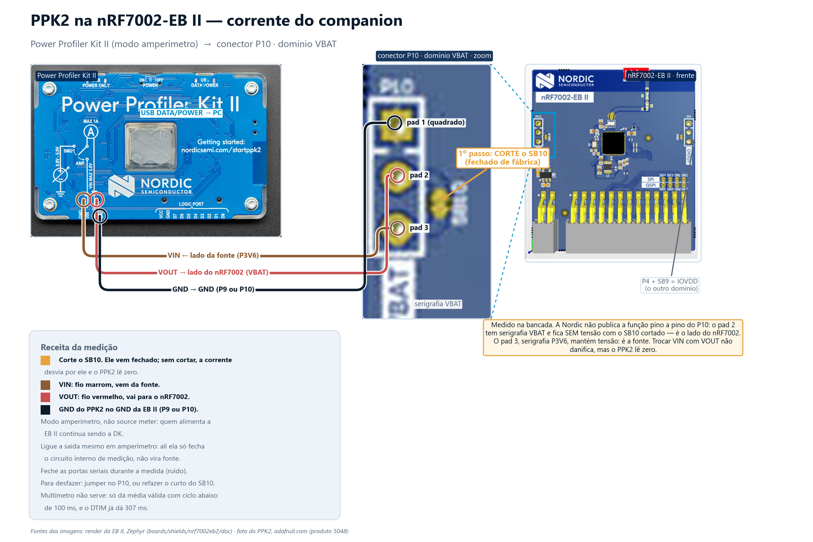

# Wi-Fi · Lab 11 — a escada de economia de energia

> **Antes de tudo: o console troca de VCOM.** Com a nRF7002-EB II acoplada, o overlay
> do shield move o console (e o `shell-uart`) da `uart20` para a `uart30` — e isso
> troca também a porta serial do PC: sem shield, o log sai na **segunda** VCOM da DK;
> com o shield, sai na **primeira**. Mesma troca medida e confirmada no lab 6
> (`comms/06_wifi_shell/README.md`, Passo 2).

> **Origem.** Cópia integral de `nrf/samples/wifi/twt` do **nRF Connect SDK v3.4.0**.
> Licença Nordic preservada em [LICENSE](LICENSE). Levam o cabeçalho `ORIGEM:` do
> curso o `prj.conf`, o `CMakeLists.txt`, o `src/main.c` e os seis de
> `modules/traffic_gen/`. A única divergência é a mesma dos labs 7 e 9, e
> está nos dois primeiros: as credenciais saem para `minha_rede.conf` e o
> `CMakeLists.txt` ganha uma falha proposital de build quando ele está vazio. O
> `src/main.c` e o `modules/traffic_gen/` estão byte a byte iguais ao SDK, e o
> cabeçalho de cada um diz isso e traz o `diff` para conferir.

Este lab fecha o bloco de **energia e transporte** da frente de Wi-Fi — depois dele
o módulo segue para os dois temas que diferenciam Wi-Fi 6 na prática, coexistência
(lab 12) e locationing (lab 13). Ele trata do que costuma ficar menos claro no
material introdutório: economia de energia não é uma escolha entre "antigo" e
"moderno", é uma **escada de três degraus**. Cada degrau tem um dono diferente do
intervalo de dormida, e só o último exige Wi-Fi 6.

O lab tem duas partes:

- **Parte A — degraus 1 e 2 (DTIM e listen interval).** Não depende de Wi-Fi 6 nem de
  um AP com TWT. **Passo 1**, por latência: fecha por completo com o firmware do
  **lab 6** (o shell) e um `ping` do PC — o efeito de cada regime aparece direto na
  **latência de descida**. **Passo 2**, por corrente: o mesmo firmware, agora com o
  PPK2 — roteiro pronto, valores pendentes da decisão do instrutor sobre o solder
  bridge da EB II.
- **Parte B — degrau 3 (TWT).** Depende de um AP que negocie TWT individual. Na
  bancada de preparação, a ONT da sala é 802.11ax confirmado e respondeu
  `Peer not TWT capable` — fica pendente de um AP com TWT (EX3000).

## Hardware

| Peça | Papel |
|---|---|
| **nRF54LM20-DK** (variante B, `nrf54lm20b`) | roda o firmware; host do Wi-Fi |
| **nRF7002 EB-II** | shield companion Wi-Fi 6, encaixado no header de expansão |
| **PC** | terminal serial, `ping` (Parte A) e `traffic_gen_server.py` (Parte B) |
| **PPK2** | corrente dos regimes (Passo 2) — roteiro pronto, valores a confirmar |

## A escada de três degraus

| Degrau | Quem controla o intervalo de dormida | Precisa de Wi-Fi 6 | Perde broadcast/multicast |
|---|---|---|---|
| **DTIM Power Save** | o **AP** | não | não |
| **Extended Power Save** (listen interval) | a **estação** | não | **sim** |
| **TWT** (deep sleep) | **negociado** entre estação e AP | **sim** | **sim** |

O quadro por trás: o AP transmite um **beacon** periódico (medido na bancada: 100
unidades de tempo, ~102,4 ms). O **TIM** não é um quadro separado — é um
**elemento dentro do próprio beacon**, um bitmap dizendo quais estações têm
quadro unicast à espera. O **DTIM** não é outro mecanismo, é uma ocorrência
privilegiada do TIM: um beacon a cada N é um DTIM (medido: N=3, ~307 ms), e é só
depois dele que sai o tráfego de grupo (broadcast/multicast). A relação a levar:
**todo beacon carrega um TIM; um beacon a cada N é um DTIM.**

- **Degrau 1 — DTIM**, o padrão do nRF70 assim que conecta. A estação acorda
  alinhada ao DTIM; quem manda no período é o AP, a estação não pede alteração.
- **Degrau 2 — Extended Power Save (listen interval)**, o mais esquecido e o mais
  útil aqui, porque **não depende de Wi-Fi 6**. A estação acorda a cada *N* beacons
  em vez de a cada DTIM, arredondado para o múltiplo do DTIM que cabe em *N*: com
  listen interval 10 e DTIM 3, acorda a cada **9** beacons. O preço é perder os
  quadros de grupo. Viaja no quadro de associação — só vale **antes de conectar**.
- **Degrau 3 — TWT**, aqui sim Wi-Fi 6. A estação negocia o seu próprio horário com
  o AP em vez de herdar o calendário coletivo. O preço é o mesmo do degrau 2, mais
  explícito: não acorda para os beacons de DTIM enquanto a sessão estiver de pé.

Transversal aos três: o nRF70 sai do modo de economia sozinho quando há tráfego e
volta depois do *inactivity timer* (100 ms por padrão) — um botão à parte do degrau
escolhido. E uma regra geral, para não repetir o erro do material introdutório:
**não é "TWT é o moderno, DTIM é o legado"**. DTIM é melhor para vazão alta e
latência baixa; TWT é melhor para dormidas de dezenas de segundos com tráfego
periódico previsível; o listen interval fica no meio e é a resposta para quem não
tem AP com TWT.

## Parte A, Passo 1 — a escada por latência, sem PPK2 (firmware do lab 6)

Grave `comms/06_wifi_shell` (não este diretório) e conecte na rede da sala. A partir
daqui, tudo é shell — nenhuma linha de firmware deste lab entra no Passo 1.

```
wifi ps off                              # sem economia
wifi ps on
wifi ps_wakeup_mode dtim                 # degrau 1
wifi ps_listen_interval <n>              # ANTES de conectar
wifi ps_wakeup_mode listen_interval      # degrau 2
wifi ps                                  # confere o estado
wifi status                              # beacon interval, DTIM period, listen interval
```

Antes de cada medida, rode `wifi ps` **e** `wifi status` e anote os quatro números
que interpretam a corrente e a latência: modo de economia, listen interval, beacon
interval e DTIM period da rede. Trocar o **modo** de despertar funciona em tempo de
execução, nos dois sentidos; trocar o **valor** do listen interval exige
reconectar, porque ele viaja no quadro de associação.

**Pegadinha de comando, medida na bancada.** O comando é
**`wifi ps_listen_interval`**, não `wifi listen_interval`. Errar o nome **não
devolve erro**: o shell imprime o help inteiro e o valor **continua o de antes** —
uma medição que parece válida e não é. Sempre conferir com `wifi ps` depois de
setar.

### Resultado medido — latência de descida (20 pings por regime, `ping` do PC)

Bancada: ONT Askey RTF8225VW-SV, 2,4 GHz, canal 6, 802.11ax/HE, RSSI −44.
`Beacon Interval: 100` (~102,4 ms), `DTIM: 3` (~307 ms). 20 pings por regime, zero
perdas nos três.

| Regime | mediana | máximo |
|---|---|---|
| sem economia (`wifi ps off`) | 12 ms | 269 ms |
| DTIM 3, o padrão | 168 ms | 332 ms |
| listen interval 10 | 525 ms | 938 ms |

A teoria prevê os números: em DTIM o quadro espera uma fração aleatória do período
de 307 ms (média perto da metade, máximo perto do período); com listen interval 10
sobre DTIM 3 a estação acorda a cada 9 beacons, 922 ms — medido mediana 525 e
máximo 938.

Escalando o listen interval, o máximo cresce de forma monotônica. A linha do listen
interval 10 aparece nas duas tabelas com números um pouco diferentes (525/938 acima,
527/913 aqui) porque são **duas corridas separadas** do mesmo regime: cada quadro
espera uma fração aleatória do período de dormida, então a mediana e o máximo de uma
amostra finita não se repetem exatamente. A diferença entre as duas corridas — 2 ms na
mediana, 25 ms no máximo — é da ordem de grandeza dessa variação, e é ela própria a
medida de quanto confiar em uma corrida só.

| listen interval | acordar previsto | mediana medida | máximo medido |
|---|---|---|---|
| 10 | 922 ms | 527 ms | 913 ms |
| 30 | 3072 ms | 1459 ms | 2038 ms |
| 60 | 6144 ms | 1116 ms | 5130 ms |

**Armadilha de método, e ela é o ponto do passo.** Quando o período de dormida
passa do intervalo entre pings, vários pedidos ficam bufferizados no AP e voltam
**juntos** numa mesma janela de despertar. Só o primeiro paga a latência cheia; os
demais puxam a mediana para baixo — é por isso que a linha de listen interval 60
tem mediana 1116 e máximo 5130. **Com dormida longa, a estatística que significa
alguma coisa é o máximo, não a mediana.**

## Parte A, Passo 2 — a escada por corrente, com o PPK2

> **A confirmar na bancada.** Este passo é o roteiro; nenhum valor de corrente foi
> medido ainda. As linhas da tabela abaixo ficam pendentes até a medida.

### Ponto de medição — levantado, e não é o óbvio

O ponto natural pareceria o **P14** da nRF54LM20-DK (o mesmo do Edge AI), mas ele
mede **só o SoC hospedeiro** (domínio VDD:nRF) — a corrente que muda entre DTIM,
listen interval e TWT é a do **companion**, e o VDD:IO que alimenta a EB II é um
seguidor de tensão **bufferizado** a partir do VDD:nRF, de propósito para que
correntes de fuga não sejam contadas em medidas de baixo consumo do SoC. Ou seja,
**o P14 não enxerga o nRF7002**.

O companion mede-se na própria **EB II**:

| O que se quer medir | Conector | Preparo | Modo do PPK2 |
|---|---|---|---|
| Companion, domínio VBAT (o do rádio) | **P10** | cortar o solder bridge **SB10** (fechado de fábrica) | *ampere meter* |
| Companion, domínio IOVDD | **P4** | cortar o solder bridge **SB9** (fechado de fábrica) | *ampere meter* |

Para o nosso caso o domínio que interessa é o **VBAT** (P10) — é ele que alimenta o
rádio; o IOVDD é só a interface. PPK2 em **modo amperímetro**, ligado entre os
pinos de P10, com GND em P9 ou no próprio P10. Para voltar ao funcionamento normal
da EB II depois da medida: jumper em P10, ou refazer o curto de SB10.



**Decisão pendente do instrutor — três saídas, sem escolha feita aqui:**

1. **Um kit do instrutor com SB10 cortado**, e a medida projetada para a turma: os
   alunos rodam os regimes e leem a diferença no `wifi ps` e na latência (Passo 1);
   a corrente aparece uma vez, no kit preparado. Custo: uma solda, num kit só.
2. **Medir o hospedeiro em P14 em todos os kits**, deixando claro que aquilo é o
   consumo do SoC e **não** o do rádio Wi-Fi — serve para falar de instrumentação,
   não para provar a economia do Wi-Fi.
3. **Cortar SB10 nos seis kits**, dá a medida certa em toda bancada e custa seis
   soldas mais o retrabalho de restaurar depois.

### Por que não dá para usar um multímetro

A documentação de hardware da EB II avisa que um amperímetro comum só dá média
válida com ciclo de carga **abaixo de 100 ms**, para integrar ciclos inteiros. Os
nossos regimes violam isso de propósito: DTIM 3 já são ~307 ms, listen interval 10
são ~922 ms, e TWT pode passar de minutos. O PPK2 não tem essa limitação — amostra
a 100 kSa/s e a média é feita sobre a janela que o operador escolhe.

### Roteiro

1. **Gravar a DK antes de colocar o PPK2**, e recolocar o jumper de corrente ao
   terminar.

   > **Atenção — o mesmo aviso dos labs de Channel Sounding.** O PPK2 no jumper de
   > corrente da DK foi o que quebrou o SWD naqueles labs. Neste lab o PPK2 fica na
   > EB II (P10/P4), não no jumper da DK — mas a disciplina de gravar antes e
   > desconectar depois é a mesma.

2. PPK2 em **modo amperímetro** (não *source meter* — a própria DK já alimenta a
   EB II). "Enable power output" precisa ficar ligado mesmo assim: em modo
   amperímetro ele não liga fonte nenhuma, só fecha o circuito interno de medição
   e deixa a corrente passar pelo caminho medido.
3. Um cabo USB alimenta o PPK2 até 500 mA; para picos até 1 A (a transmissão do
   nRF7002), usar dois cabos. Vale conferir o pico de transmissão na primeira
   captura antes de confiar nas médias.
4. **Opcional — marcador de despertar no analisador lógico do PPK2.** O PPK2 tem
   entradas digitais que funcionam como analisador lógico simples, sincronizadas
   com a captura de corrente. Ligando uma delas a um GPIO que o firmware chaveia
   no início e no fim da janela de despertar, o gráfico mostra a corrente e o
   evento de código lado a lado na mesma tela — o pico de corrente e o marcador
   aparecem alinhados, em vez de pedir para o aluno acreditar que a coincidência
   temporal é o despertar negociado. Custa um pino livre e um trecho de firmware
   (alternar o GPIO ao entrar/sair do período ativo); o lab funciona sem isso.
5. Repetir os três regimes do Passo 1, 60 s por regime, corrente média:

   | Regime | Comando | Corrente média |
   |---|---|---|
   | sem economia | `wifi ps off` | > **A confirmar na bancada.** |
   | DTIM (padrão) | `wifi ps on` + `wifi ps_wakeup_mode dtim` | > **A confirmar na bancada.** |
   | listen interval 10 | `wifi ps_listen_interval 10` (antes de conectar) + `wifi ps_wakeup_mode listen_interval` | > **A confirmar na bancada.** |

## Parte B — TWT (pendente do AP)

TWT é um **acordo**: a estação negocia com o AP o seu próprio horário de despertar,
em vez de herdar o calendário coletivo de DTIM. Dorme de segundos a horas — e, como
o degrau 2, não acorda para os beacons de DTIM enquanto a sessão está de pé, logo
não recebe broadcast nem multicast. No nRF Connect SDK v3.4.0 o driver do nRF70
implementa só o TWT **Individual**: o comando `wifi twt btwt_setup` existe no shell
do Zephyr, mas não tem driver por trás nesta versão.

### Compilar e gravar este firmware (só necessário para a Parte B)

Este diretório é a cópia do sample `nrf/samples/wifi/twt`, usado só na Parte B —
a Parte A roda inteira no firmware do lab 6.

```bash
cd C:\ncs\v3.4.0
nrfutil sdk-manager toolchain launch --ncs-version v3.4.0 -- west build -p -b nrf54lm20dk/nrf54lm20b/cpuapp --sysbuild -d C:/work/nrf-manaus-2/comms/11_wifi_twt/build_lm20 C:/work/nrf-manaus-2/comms/11_wifi_twt -- -D11_wifi_twt_SHIELD="nrf7002eb2" -D11_wifi_twt_SNIPPET=nrf70-wifi -D11_wifi_twt_EXTRA_CONF_FILE=minha_rede.conf
nrfutil sdk-manager toolchain launch --ncs-version v3.4.0 -- west flash -d C:/work/nrf-manaus-2/comms/11_wifi_twt/build_lm20
```

`SHIELD` e `SNIPPET` levam o prefixo `11_wifi_twt_` (o nome da imagem no sysbuild)
porque, sem prefixo, valeriam para **todas** as imagens; `EXTRA_CONF_FILE` e
qualquer `CONFIG_*` já valem para a aplicação principal sem prefixo. Build limpo
nesta bancada, `exit 0`:

| Região | Usado | Região total | % usado |
|---|---|---|---|
| FLASH | 558284 B | 2036 KB | 26,78% |
| RAM | 266048 B | 511 KB | 50,84% |

Se for usar o `traffic_gen`, ajuste `CONFIG_TRAFFIC_GEN_REMOTE_IPV4_ADDR` para o IP
do PC (por linha de comando, como o `CONFIG_LAB_SERVIDOR_IP` do lab 9, para não
gravar IP nenhum em arquivo versionado) e suba o servidor:

```bash
python C:/ncs/v3.4.0/nrf/scripts/traffic_gen_server.py
```

### Comando de TWT — e a pegadinha do material online

```
wifi twt quick_setup <wake_interval_us> <interval_us>
wifi twt teardown_all
```

> **Armadilha do material online, testada nesta árvore.** O curso e o blog da
> Nordic usam a forma posicional, por exemplo
> `wifi twt setup 0 0 1 1 0 1 1 1 8 60000`. Nesta árvore (Zephyr 4.4.0, NCS v3.4.0)
> ela **falha** com `setup: wrong parameter count`. A forma atual é por opções
> longas, com 25 argumentos, ou o atalho `wifi twt quick_setup`, usado acima. Quem
> copiar o comando do material online recebe erro.

### Estado da negociação

Medido na bancada de preparação: a ONT Askey da sala é 802.11ax confirmado e
responde `Peer not TWT capable` — não negocia TWT individual. A Parte B depende de
um AP que negocie (EX3000, ainda não confirmado). Se o AP também não negociar, o
resultado registrado é este mesmo — negativo, mas com valor didático: mostra que
TWT é um acordo, não um recurso automático do driver.

| Regime | Comando | Corrente média (60 s) |
|---|---|---|
| TWT ligado | `wifi twt quick_setup <wake_us> <interval_us>` | pendente — depende do AP |
| TWT desligado (volta a DTIM) | `wifi twt teardown_all` | pendente — depende do AP |

### Se aparecer um AP com TWT no curso — receita pronta, não testada

**Decisão do instrutor (2026-09-07): o EX3000 foi descartado** e a Parte B não será
ensaiada antes do curso. O que segue está pronto para ser executado se algum AP com TWT
aparecer em sala — mas **nada aqui foi verificado nesta bancada**, e é preciso dizer isso
à turma se for demonstrado ao vivo.

Sequência mínima, com o firmware deste lab já gravado e associado ao AP:

```
wifi status                       # confirmar: TWT: Supported (na nossa ONT dá Not supported)
wifi ps                           # anotar o estado de partida
wifi twt quick_setup 65024 524288 # acorda ~65 ms a cada ~524 ms
wifi ps                           # deve listar um TWT flow
...medir 60 s com o PPK2...
wifi twt teardown_all             # volta ao DTIM
```

Para o intervalo de 1 minuto, que é o ponto de comparação com o datasheet:

```
wifi twt quick_setup 8192 60000000    # 8,192 ms acordado, 60 s de intervalo
```

O `8192 µs` não é arbitrário: é a duração mínima de despertar que o datasheet do nRF7002
usa na medida de TWT, e a documentação da Nordic recomenda **não descer abaixo de 8 ms**,
sob pena de perder dados.

### O que essa medida precisaria mostrar — e o que ela NÃO vai resolver

A Parte A já mediu tudo que dá para medir sem TWT, e isso define o que esperar:

| | medido nesta bancada | TWT (datasheet, 1 min) |
|---|---|---|
| Melhor corrente sem TWT | **31 µA** (listen interval 600, ~72 s de sono) | 29,5 µA |
| Downlink nesse regime | **morto** — 1 ping em 481 | também perdido (ver abaixo) |

**A surpresa da Parte A: em corrente, o TWT praticamente empata com o listen interval.**
Se a demonstração ao vivo der ~30 µA, ela terá confirmado o datasheet — e mostrado que o
ganho de energia **não** é o argumento do TWT.

E há uma expectativa que precisa ser corrigida antes de virar slide: **o TWT não vai fazer
o ping voltar a funcionar.** A documentação da Nordic é explícita — o AP *"may buffer
traffic until the next interval **if sleep duration is in the order of 100 ms**"*, mas
*"**it will not buffer** the device data if the sleep duration is in the order of minutes,
and data will be lost"*. Com TWT de 1 minuto o dispositivo fica tão inalcançável quanto
ficou com o listen interval 600.

### Então qual é o argumento do TWT

**Determinismo, não economia.** No listen interval a estação avisa de quantos em quantos
beacons vai acordar, e pronto: ao acordar, **disputa o meio** com todas as outras estações
que acordaram no mesmo beacon. No TWT o AP **concorda com um horário** e reserva a *service
period* — manda *trigger frames*, aloca os Resource Units. O despertar passa a ter duração
acordada (8 a 256 ms) em vez de variável.

Isso aparece nos nossos números: os despertares de listen interval medidos aqui duraram
**24 a 86 ms**, irregulares, porque o rádio espera a vez. A duração de despertar do TWT é
escolhida, não sofrida.

E é por isso que a vantagem **cresce com o número de dispositivos** — e quase não apareceu
nesta bancada, com um kit só numa rede doméstica quieta. Numa sala com vários kits, ou numa
fábrica, apareceria. Se a demonstração for feita com um dispositivo só, esse é o limite a
declarar.


## Números da Nordic — ordem de grandeza, nunca na nossa tabela

A Nordic publica, para o **nRF7002 DK com host nRF5340** — não a nossa combinação
LM20-DK + EB II —: ~2 mA em DTIM de 200 ms, ~15 µA dormindo, ~24–28 µA de média com
TWT de 5 a 10 minutos. Servem como ordem de grandeza na aula, sempre atribuídos à
fonte, e **nunca** entram numa tabela nossa como se fossem medição da bancada.

## As três armadilhas do material online da Nordic (resumo)

1. **Sintaxe de TWT.** A forma posicional do material online falha nesta árvore;
   usar `wifi twt quick_setup` ou a forma por opções longas.
2. **Ponto de medição do PPK2.** As instruções publicadas (jumper P23, Vout no
   P23 pino 1, GND no P21) são do nRF7002 DK com host nRF5340 — não servem aqui. Na
   nossa bancada o companion mede-se na EB II, P10, com o SB10 cortado.
3. **Multímetro não serve nesta faixa.** Um amperímetro comum só dá média válida
   com ciclo abaixo de 100 ms; o DTIM da bancada já dá ~307 ms.
