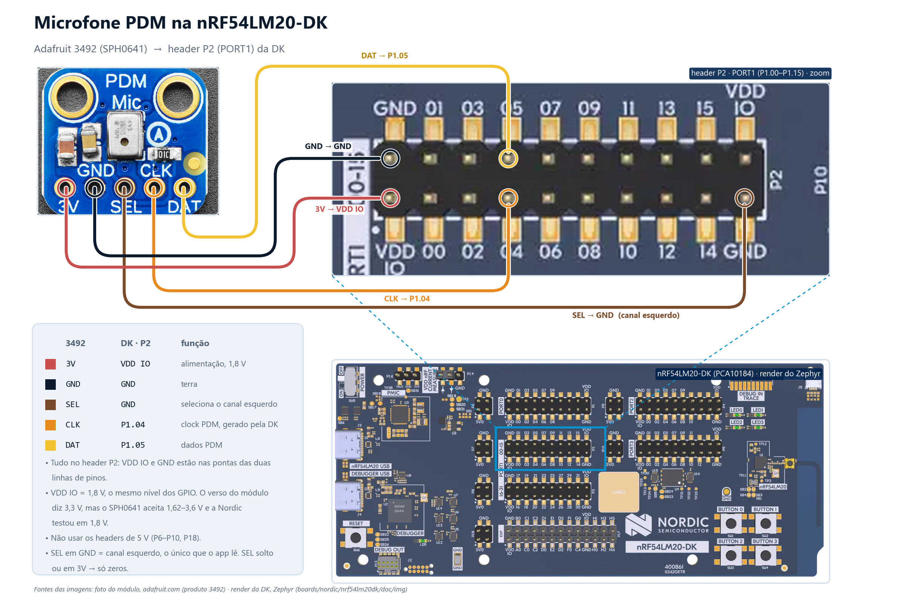

# 06 · Prova de bancada do microfone PDM (`mic_check`)

Antes de pôr um modelo de voz na NPU ([`07_ww_kws/`](../07_ww_kws/)), prove a fiação:
um modelo mudo não diz se o problema é fio, canal, alimentação ou o modelo. Este
exemplo — código do curso, Zephyr puro, sem o Add-on — configura o **PDM20 exatamente
como o app da Nordic** (16 kHz, 16 bits, canal esquerdo, blocos de 10 ms) e imprime o
nível do sinal dez vezes por segundo, com uma barra de VU.

## Hardware

nRF54LM20-DK (variante **B**) + microfone PDM MEMS **Adafruit 3492** (SPH0641). É o
mesmo módulo com que a Nordic testou o `ww_kws`. Fios fêmea-fêmea nos pinos da DK; a
barra de pinos do breakout precisa estar soldada.



| Adafruit 3492 | nRF54LM20-DK | Fio | Por quê |
|---|---|---|---|
| `3V` | **`VDD:IO`** | vermelho | alimentação do mic **no mesmo nível lógico dos GPIO** (1,8 V por padrão). O verso do módulo diz "Vin/Vlogic: 3.3V", mas o SPH0641 aceita 1,62–3,6 V e a Nordic testou em 1,8 V |
| `GND` | `GND` | preto | |
| `SEL` | `GND` | marrom | escolhe o **canal esquerdo**; o app só lê esse canal |
| `CLK` | **`P1.04`** | laranja | clock PDM gerado pela DK (1–3,25 MHz) |
| `DAT` | **`P1.05`** | amarelo | dados PDM |

- **Tudo cabe no header P2** (serigrafia `PORT1 00-15`, 2×10 pinos): a linha de cima é
  `GND 01 03 05 … 15 VDD IO`, a de baixo `VDD IO 00 02 04 … 14 GND`. `P1.05` é o 4º pino da
  linha de cima, `P1.04` o 4º da linha de baixo; `VDD IO` e `GND` estão nas pontas.
- Os headers de alimentação **P6–P10 e P18 são 5 V — não usar**: o mic aguenta, mas o
  `DAT` voltaria em 5 V para um GPIO de 1,8 V.
- `SEL` solto ou em `3V` põe o dado na outra borda do clock e o app lê **zeros**.
- A distância mic-DK não é crítica com fios de 10–20 cm; acima disso o clock PDM começa a
  sofrer.

Os pinos vêm do overlay [`boards/nrf54lm20dk_nrf54lm20b_cpuapp.overlay`](boards/nrf54lm20dk_nrf54lm20b_cpuapp.overlay) —
o mesmo par CLK/DAT do `07_ww_kws`.

## A interface PDM — o que viaja nesses dois fios

O microfone MEMS digital já tem o conversor dentro: um **modulador sigma-delta** que
cospe **1 bit por pulso de clock** — a *densidade* de 1s codifica a amplitude do som
(daí o nome, *pulse density modulation*). Nenhum sinal analógico chega à DK.

Do lado do nRF54LM20, **PDM é um periférico de verdade** (o SoC tem dois, `PDM20` e
`PDM21`) — não é GPIO manipulado por software:

```
  SPH0641 (mic)                PDM20 (periférico)                         aplicação
┌───────────────┐  ◄── CLK ── ┌────────────────────────────────┐
│ som → Σ∆ 1bit │             │ gera o clock (1–3,25 MHz aqui) │  blocos de 160
│               │  ── DAT ──► │ amostra DAT na borda escolhida │  amostras (10 ms)
└───────────────┘   1 bit/clk │ filtro CIC + HP + ganho (HW)   │ ────────────────► dmic_read()
                              │ → PCM 16 bit @ 16 kHz          │   (CPU dormindo
                              │ → EasyDMA → RAM                │    o tempo todo)
                              └────────────────────────────────┘
```

- **O periférico gera o `PDM_CLK`** e amostra o `DAT` sozinho. Os GPIOs entram só como
  pinos físicos: o pinctrl do overlay (`NRF_PSEL(PDM_CLK, 1, 4)` / `PDM_DIN, 1, 5`)
  rota os sinais, e o PDM20 só aceita pinos dos **portos P1 ou P3** — por isso o
  exemplo usa `P1.04`/`P1.05`, e não um pino qualquer.
- **Um fio de dado, até dois mics:** o periférico amostra o `DAT` na **borda de
  descida** para o canal esquerdo e na de subida para o direito. O pino `SEL` do mic
  diz em qual meia-onda ele dirige a linha — `SEL`=GND → esquerdo → casa com o
  `PDM_CHAN_LEFT` que o app pede. É por isso que `SEL` no lado errado zera o áudio.
- **A conversão PDM→PCM é hardware:** um filtro de decimação (CIC de 5ª ordem), filtro
  passa-alta e ganho de ±20 dB transformam o bitstream de MHz em amostras **PCM de
  16 bits a 16 kHz** (ex.: clock de 1,28 MHz ÷ razão 80 = 16 kHz).
- **EasyDMA** escreve as amostras prontas direto na RAM. No Zephyr (driver `nrfx_pdm`
  + API `dmic`), isso vira blocos de 160 amostras num *mem slab*: o `dmic_read()` do
  app só recolhe buffers cheios — a CPU não toca em amostra nenhuma no caminho.

Fonte: datasheet do nRF54LM20A/B, capítulo *PDM — Pulse density modulation interface*
(<https://docs.nordicsemi.com/r/bundle/ps_nrf54lm20a/page/pdm.html>).

## Build

Zephyr puro: compila direto do SDK padrão, **sem** o workspace do Add-on. Entre no
ambiente do toolchain primeiro:

```
nrfutil sdk-manager toolchain launch --ncs-version v3.4.0 --terminal
```

Depois, de dentro de `C:\ncs\v3.4.0`:

```
west build -p -b nrf54lm20dk/nrf54lm20b/cpuapp --sysbuild ^
     -d C:\work\nrf-manaus-2\edge_ai\06_mic_check\build_lm20 ^
     C:\work\nrf-manaus-2\edge_ai\06_mic_check
nrfutil device program --firmware edge_ai\06_mic_check\build_lm20\06_mic_check\zephyr\zephyr.hex --serial-number <serial>
nrfutil device reset --serial-number <serial>
```

## O que se vê

Terminal na **VCOM1** (a segunda COM da DK), 115200:

```
=== mic_check: PDM20 CLK=P1.04 DAT=P1.05 SEL=GND, 16 kHz mono (canal esquerdo) ===
PDM rodando. Fale perto do microfone e veja a barra subir.

[   12] rms=   61 pico=  310 dc=    -4 |##########                    |  -54 dBFS   <- sala em silêncio
[   13] rms= 2870 pico=14020 dc=    12 |####################          |  -21 dBFS   <- falando perto
```

| Sintoma | Causa provável |
|---|---|
| `AMOSTRAS TODAS IGUAIS (0)` em todas as linhas | `DAT` solto, `SEL` no lado errado (ou solto) ou mic sem alimentação |
| `rms` alto e **constante**, barra cheia sem som | `CLK` trocado com `DAT`, ou mic recebendo 5 V |
| `dmic_read falhou` | o PDM não está entregando blocos: overlay/pino errado — não é fio |
| Nível reage à voz | fiação **validada**; siga para o [`07_ww_kws/`](../07_ww_kws/) |
