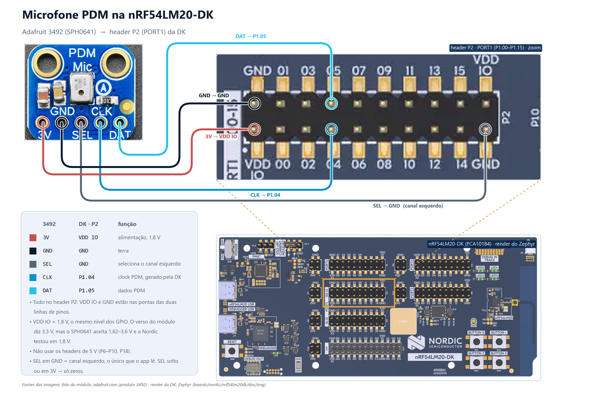

# 06 · Wake word e comandos de voz na NPU (Axon)

Primeiro exemplo do módulo que **não roda na CPU**: um microfone PDM alimenta dois modelos
TensorFlow Lite compilados para o **Axon**, a NPU do nRF54LM20B. O primeiro escuta a
frase de ativação **"Okay Nordic"**; quando ela é detectada, o segundo passa a reconhecer
dez comandos (**Go, Stop, Up, Down, Yes, No, On, Off, Right, Left**) por alguns segundos
e depois volta a esperar a frase.

> **Origem:** cópia literal de `applications/ww_kws` do
> **Edge AI Add-on for nRF Connect SDK v2.3.0** (tag `v2.3.0`, commit `1c24f3a`),
> copiada em 2026-09-04. Os arquivos principais carregam o caminho upstream no cabeçalho;
> licença Nordic preservada em [LICENSE](LICENSE). A subpasta [`mic_check/`](mic_check/)
> é código do curso.

## O que ele demonstra

- **Áudio 16 kHz mono** vindo do periférico **PDM20** em blocos de 10 ms (`src/dmic.c`),
  canal esquerdo.
- **Dois modelos na mesma app**, cada um com seu `nrf_edgeai_generated/`
  (`src/ww/` e `src/kws/`), os dois com a variante `_axon.h`: o descritor que a engine
  entrega para a NPU em vez de executar na CPU.
- **Pós-processamento é do aplicativo, não do modelo:** a wake word só é aceita quando
  `WW_COUNT_THRESHOLD` das últimas `WW_HISTORY_SIZE` predições (uma a cada 30 ms) passam
  de `WW_PROBABILITY_THRESHOLD`; os comandos usam média móvel exponencial
  (`KWS_EMA_ALPHA`). Tudo Kconfig, em [`Kconfig`](Kconfig).
- **Duas seriais:** os logs do Zephyr saem no console de sempre (`uart20`, **VCOM1**) e as
  mensagens de estado do app (`Waiting for wakeword`, `Keyword spotted: Yes`…) saem na
  `uart30` (**VCOM0**), escolhida pelo `chosen ncs,control-output-uart` no overlay.
- **Buffers do Axon** dimensionados para os modelos embarcados no `prj.conf`
  (`CONFIG_NRF_AXON_INTERLAYER_BUFFER_SIZE=6656`): trocar de modelo pode exigir trocar
  esse número.

## Hardware

nRF54LM20-DK (variante **B**) + microfone PDM MEMS **Adafruit 3492** (SPH0641). É o
mesmo módulo com que a Nordic testou o app. Fios fêmea-fêmea nos pinos da DK; a barra de
pinos do breakout precisa estar soldada.



| Adafruit 3492 | nRF54LM20-DK | Por quê |
|---|---|---|
| `3V` | **`VDD:IO`** | alimentação do mic **no mesmo nível lógico dos GPIO** (1,8 V por padrão). O verso do módulo diz "Vin/Vlogic: 3.3V", mas o SPH0641 aceita 1,62–3,6 V e a Nordic testou em 1,8 V |
| `GND` | `GND` | |
| `SEL` | `GND` | escolhe o **canal esquerdo**; o app só lê esse canal |
| `CLK` | **`P1.04`** | clock PDM gerado pela DK (1–3,25 MHz) |
| `DAT` | **`P1.05`** | dados PDM |

- **Tudo cabe no header P2** (serigrafia `PORT1 00-15`, 2×10 pinos): a linha de cima é
  `GND 01 03 05 … 15 VDD IO`, a de baixo `VDD IO 00 02 04 … 14 GND`. `P1.05` é o 4º pino da
  linha de cima, `P1.04` o 4º da linha de baixo; `VDD IO` e `GND` estão nas pontas.
- Os headers de alimentação **P6–P10 e P18 são 5 V — não usar**: o mic aguenta, mas o
  `DAT` voltaria em 5 V para um GPIO de 1,8 V.
- `SEL` solto ou em `3V` põe o dado na outra borda do clock e o app lê **zeros**.
- A distância mic-DK não é crítica com fios de 10–20 cm; acima disso o clock PDM começa a
  sofrer.

Os pinos vêm do overlay [`boards/nrf54lm20dk_nrf54lm20b_cpuapp.overlay`](boards/nrf54lm20dk_nrf54lm20b_cpuapp.overlay);
para outro microfone, os limites de clock e ciclo de trabalho ficam em `src/dmic.c`.

## Passo 0 — provar o microfone antes do modelo (`mic_check/`)

Um modelo mudo não diz se o problema é fio, canal, alimentação ou o modelo. O
[`mic_check/`](mic_check/) configura o PDM **exatamente como o app** e imprime o nível
do sinal dez vezes por segundo, com uma barra de VU:

```
cd C:\ncs\sdk-edge-ai
west build -b nrf54lm20dk/nrf54lm20b/cpuapp --sysbuild ^
     -d C:\work\nrf-manaus-2\edge_ai\06_ww_kws\mic_check\build_lm20 ^
     C:\work\nrf-manaus-2\edge_ai\06_ww_kws\mic_check
nrfutil device program --firmware edge_ai\06_ww_kws\mic_check\build_lm20\mic_check\zephyr\zephyr.hex --serial-number <serial>
nrfutil device reset --serial-number <serial>
```

Terminal na **VCOM1** (a segunda COM da DK), 115200. O que se vê:

```
=== mic_check: PDM20 CLK=P1.04 DAT=P1.05 SEL=GND, 16 kHz mono (canal esquerdo) ===
PDM rodando. Fale perto do microfone e veja a barra subir.

[   12] rms=   61 pico=  310 dc=    -4 |##########                    |  -54 dBFS   <- sala em silêncio
[   13] rms= 2870 pico=14020 dc=    12 |####################          |  -21 dBFS   <- falando perto
```

| Sintoma | Causa provável |
|---|---|
| `AMOSTRAS TODAS IGUAIS (0)` em todas as linhas | `DAT` solto, `SEL` no lado errado (ou solto) ou mic sem alimentação |
| `rms` alto e **constante**, barra cheia sem som | `CLK` trocado com `DAT`, ou mic recebendo 5 V |
| `dmic_read falhou` | o PDM não está entregando blocos: overlay/pino errado — não é fio |
| Nível reage à voz | fiação **validada**; siga para o modelo |

## Passo 1 — o app da Nordic

```
cd C:\ncs\sdk-edge-ai
west build -b nrf54lm20dk/nrf54lm20b/cpuapp --sysbuild ^
     -d C:\work\nrf-manaus-2\edge_ai\06_ww_kws\build_lm20 ^
     C:\work\nrf-manaus-2\edge_ai\06_ww_kws
nrfutil device program --firmware edge_ai\06_ww_kws\build_lm20\06_ww_kws\zephyr\zephyr.hex --serial-number <serial>
nrfutil device reset --serial-number <serial>
```

Dois terminais, os dois a 115200:

| COM | UART | O que sai |
|---|---|---|
| **VCOM0** (primeira COM da DK) | `uart30` | estados do app: `Waiting for wakeword`, `Wakeword detected`, `Waiting for keywords`, `Keyword spotted: <nome>`, `Keyword spotting window timeout` |
| **VCOM1** (segunda COM) | `uart20` | logs do Zephyr (`Initialization completed`, erros) |

Roteiro de teste:

1. Diga **"Okay Nordic"** a ~30 cm do mic. **LED0** acende: a app entrou no estágio de
   comandos.
2. Diga um comando (**"Yes"**, **"Stop"**…). **LED1** pisca por 1 s e a VCOM0 mostra
   `Keyword spotted: Yes`.
3. Fique em silêncio 3 s (`CONFIG_KWS_PERIOD_MS`): `Keyword spotting window timeout`,
   LED0 apaga, volta a esperar a wake word.

A pronúncia dos modelos é de inglês americano. Se a frase não pega, baixar
`CONFIG_WW_PROBABILITY_THRESHOLD` (padrão 990 = 99 %) ou `CONFIG_WW_COUNT_THRESHOLD`
(padrão 15 de 20) num `.conf` extra é o primeiro ajuste; o segundo é conferir no
`mic_check` se o nível ao falar chega perto de -20 dBFS.

### Modos

`choice APP_MODE` no Kconfig:

| Opção | Comportamento |
|---|---|
| `CONFIG_APP_MODE_WW_GATED_KWS` (padrão) | wake word → janela de comandos → volta |
| `CONFIG_APP_MODE_WW_ONLY` | só a wake word; LED0 pisca a cada detecção. Bom para demonstrar a NPU com um modelo só |
| `CONFIG_APP_MODE_KWS_ONLY` | só comandos, o tempo todo |

`prj_release.conf` (`-DFILE_SUFFIX=release`) tira logs e asserts; `observability.conf`
liga o BLE + Memfault para métricas do modelo (não faz parte do roteiro do curso).

## Trocar os modelos

Os dois modelos vêm do **Edge AI Lab**, que gera wake word e comandos **a partir de texto**
(sem gravar áudio). Substituir é trocar os arquivos de `src/ww/nrf_edgeai_generated/` ou
`src/kws/nrf_edgeai_generated/` pelos baixados do Lab, apontar `ww_model`/`kws_model` para
o getter novo em `wakeword.c`/`kws.c`, e, no KWS, refazer a tabela
`keyword_detection_ctxs` com os rótulos de `nrf_edgeai_user_model_labels.h`. O
`README.rst` da Nordic (nesta pasta) detalha os passos.

## Referências

- Edge AI Add-on · *Wakeword and Keyword Spotting*:
  <https://nrfconnectdocs.nordicsemi.com/addons/addon-edge-ai/latest/applications/ww_kws/README.html>
- nRF54LM20 DK · *GPIO interface* (mapa de pinos dos headers) e *Power supply* (VDD:IO):
  <https://docs.nordicsemi.com/r/bundle/ug_nrf54lm20_dk/page/ug/nrf54lm20_dk/hw_desription/connector_if.html>
- Edge AI Lab · *Keyword spotting* / *Wake word detection*:
  <https://docs.nordicsemi.com/r/bundle/edge-ai-lab/page/keyword_spotting.html/overview>
