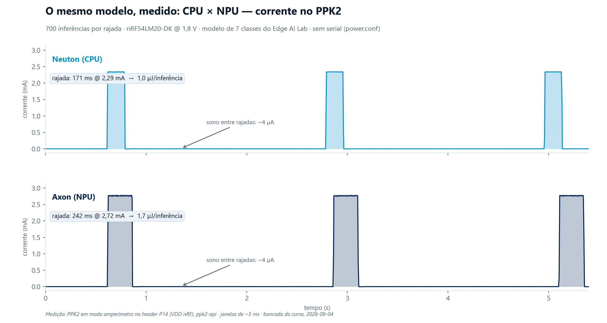
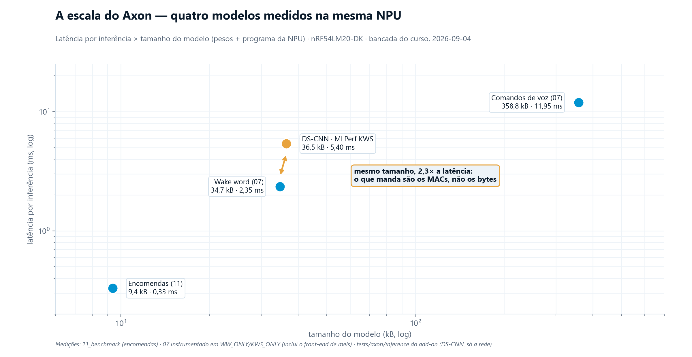
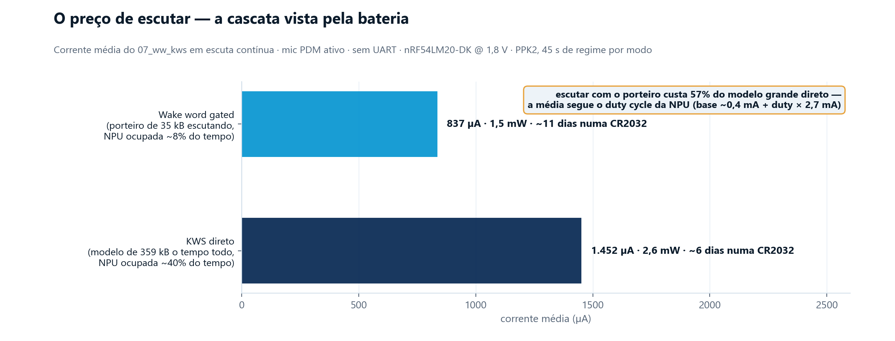
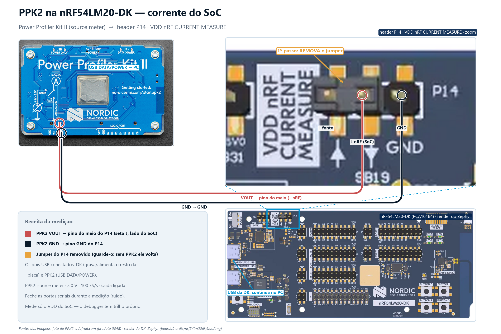

# 11 · Benchmark — o mesmo modelo na CPU (Neuton) e na NPU (Axon)

A pergunta do módulo respondida com medição: **o que muda quando o mesmo modelo sai
da CPU e vai para a NPU?** Este app compila a **mesma solution** do Edge AI Lab nos
dois backends — muda **uma escolha de Kconfig**, nenhuma linha de código — e mede
latência por inferência com estímulo idêntico e determinístico.

> **Origem dos modelos:** o par Neuton/Axon do sample `nrf_edgeai/classification` do
> Edge AI Add-on v2.3.0 (estados de encomenda: 7 classes, 1 entrada — magnitude de
> aceleração — janela de 50). É a mesma solution gerada duas vezes no Lab, uma por
> backend (solutions 90449/Neuton e 36237/Axon). Os vetores de teste (7 janelas, uma
> por classe) também vêm do sample. O harness (`src/main.c`) é do curso.

## O que muda entre Neuton e Axon — material da apresentação

**Na geração (Edge AI Lab):** o dataset, o treino e a solution são os mesmos; o que
muda é o alvo escolhido na exportação. O zip Neuton traz a rede em **float, como
código C** dentro do `nrf_edgeai_user_model.c`. O zip Axon traz a rede **quantizada
em int8 e compilada** num arquivo extra, o `nrf_edgeai_user_model_axon.h`
(*command buffer* — o programa da NPU — + pesos).

**No código gerado** (compare `src/nrf_edgeai_generated/Neuton/` e `Axon/`):

| | Neuton (CPU) | Axon (NPU) |
|---|---|---|
| Arquivos | `user_model.c/.h` + types | os mesmos **+ `user_model_axon.h`** |
| Rede | float32, executada por funções C | int8, executada pela NPU via command buffer |
| `RUN_INFERENCE_INTERFACE` | `nrf_edgeai_run_inference_neuton_f32` | `nrf_edgeai_run_inference_axon` |
| Saída | `output_propagate_neuton_f32` | `output_dequantize_axon_q8_f32` (dequantização int8→float na CPU) |
| Precisa de | — | `CONFIG_NRF_AXON` + interlayer buffer (aqui só 64 B) |

**No build:** a escolha `CONFIG_NRF_EDGEAI_CLASSIFICATION_MODEL_{NEUTON,AXON}`
(o Axon faz `select NRF_AXON`); o CMake aponta para a pasta do backend escolhido.

**O que NÃO muda — o argumento central:** o app inteiro. As 4 chamadas
(`user_model` → `init` → `feed_inputs` → `run_inference`), o formato da entrada
(f32, janela 50), o `decoded_output`, o pós-processamento. A troca CPU↔NPU é
**transparente para o código da aplicação**.

**Em runtime:** no Neuton a CPU executa as MACs em float; no Axon a CPU submete o
job e **dorme num semáforo** enquanto a NPU lê pesos da flash por DMA e trabalha —
só a dequantização e o softmax voltam para a CPU.

## Resultados medidos (bancada, 2026-09-04)

nRF54LM20-DK (B), CPU @ 128 MHz, 700 inferências por rajada, estímulo idêntico;
energia medida com o PPK2 no trilho de 1,8 V (variantes `power.conf`, sem serial):

| | Neuton (CPU) | Axon (NPU) |
|---|---|---|
| Latência por inferência (min/méd/máx) | 227 / **229** / 265 µs | 331 / **332** / 337 µs |
| Rajada de 700 inferências | 171 ms @ 2,29 mA | 242 ms @ 2,72 mA |
| **Energia por inferência** | **~1,0 µJ** | **~1,7 µJ** |
| Piso de sono entre rajadas | ~4 µA | ~4 µA |
| Classes erradas (7 janelas × 100) | 0 | 0 |
| Flash do app | 75.540 B | 95.600 B |
| RAM do app | 11.536 B | 13.080 B |



A forma de onda diz tudo de uma vez: para este modelo, a rajada da NPU é **mais
larga e mais alta** — o custo fixo por job mantém a CPU acordada além da NPU.

**A NPU perdeu em latência E em energia — e essa é a lição.** Este modelo é
minúsculo (uma rede Neuton de poucos kB); em 229 µs a CPU resolve. No caminho
Axon, o custo **fixo** de cada inferência — submeter o command buffer, workqueue,
interrupção, semáforo, dequantizar — domina o tempo, e a variante ainda carrega
~20 kB a mais de flash (driver + modelo int8 + command buffer).

**E o modelo grande?** Medimos também (via `tests/axon/compiled_models` do add-on):
o **DS-CNN do MLPerf Tiny** (KWS, a rede de referência dos benchmarks embarcados)
roda na NPU em **~5,4 ms por inferência** (5.373–5.416 ticks @ 1 MHz, 15 vetores
bit-exact). Uma rede dessas na CPU com tflite-micro leva **dezenas de ms** — é o
regime do "até 15× mais rápido / 10× mais eficiente" da Nordic, e do modelo de
comandos de voz do `07_ww_kws` (296 kB de pesos), impraticável na CPU em tempo
real. A regra para o slide:

> **NPU não é "sempre mais rápido"; é "escala para modelos que a CPU não aguenta".**
> Modelo pequeno → CPU ganha (sem overhead fixo). Modelo grande → NPU ganha por
> ordem de grandeza — e com a CPU livre (dormindo) durante a inferência, o que
> muda também a conta de energia.

Nota honesta sobre a energia: esperava-se que o Axon compensasse porque a CPU
dorme durante a inferência — mas a medição mostrou o contrário para este modelo:
a corrente da rajada Axon é **maior** (2,72 vs 2,29 mA). O caminho do driver
(submissão, workqueue, dequantização a 33 jobs/s) mantém a CPU ativa o bastante
para somar, não substituir, o consumo da NPU.

## A escala no mesmo Axon — quatro modelos medidos

Todos os modelos que o curso roda, medidos na **mesma NPU** (média de 100+
inferências cada):

| Modelo | Pesos + programa | Latência/inf. | Como foi medido |
|---|---|---|---|
| Encomendas (este exemplo) | 9,4 kB | **0,33 ms** | este harness |
| Wake word "okay nordic" (07) | 34,7 kB | **2,35 ms** | 07 em `APP_MODE_WW_ONLY`, instrumentação temporária¹ |
| DS-CNN (MLPerf Tiny KWS) | 36,5 kB | **5,4 ms** | `tests/axon/inference` do add-on (só a rede, mels pré-computados) |
| Comandos de voz (07) | 358,8 kB | **11,95 ms** | 07 em `APP_MODE_KWS_ONLY`, instrumentação temporária¹ |

¹ `k_cycle_get_32` em volta do `ww_process`/`kws_process` (inclui o front-end de
mels, que roda dentro da execução Axon), áudio ambiente, patch aplicado e
revertido sem tocar na cópia literal do repo.



As duas leituras para o slide:

- **A latência segue a computação (MACs), não os bytes.** DS-CNN e wake word têm
  o *mesmo* tamanho (36,5 vs 34,7 kB) e latências 2,3× diferentes — convolução
  reusa cada peso muitas vezes; camada densa usa uma. E o KWS tem 10× os bytes
  do wake word mas só 5× a latência.
- **O orçamento de tempo real fecha com folga.** O KWS de 12 ms numa janela de
  30 ms usa 40 % da NPU; o wake word, 8 %. É por isso que os cinco detectores do
  `10_sound_events` cabem intercalados sem esforço.

### O consumo da escuta contínua — a cascata vista pela bateria

Medido no `07_ww_kws` real (mic PDM ativo, sem UART/console — fragmento de
medição desliga log/console e a `uart20`; a `uart30` fica dormente porque o app
a exige), 45 s de regime por modo, áudio ambiente:

| Modo de escuta | Corrente média | Potência @ 1,8 V | CR2032 (225 mAh) |
|---|---|---|---|
| **Wake word gated** (porteiro de 35 kB, NPU ~8 %) | **837 µA** | 1,5 mW | ~11 dias |
| **KWS direto** (359 kB o tempo todo, NPU ~40 %) | **1.452 µA** | 2,6 mW | ~6 dias |



A média segue o *duty cycle* da NPU (base de ~0,4 mA do sistema mic+CPU +
duty × ~2,7 mA de inferência) — a arquitetura em cascata do 07 aparece
diretamente na conta de bateria: **escutar com o porteiro custa 57 %** do que
custaria rodar o modelo grande direto. CSVs crus:
`doc/edge_ai/data/ppk2_escuta_*.csv`.

## Metodologia (o que entra na conta)

- Mede-se **só o `nrf_edgeai_run_inference()`** com o relógio do sistema
  (`k_cycle_get_32` — o cycle counter DWT da CPU congela nos estados de idle e
  zerava as medições). O `feed_inputs` é um memcpy e fica fora.
- Estímulo embarcado e determinístico (as mesmas 7 janelas, sem sensor): a única
  variável entre as duas medições é **onde a rede roda**. Sem sensor também não há
  corrente de IMU contaminando a futura medição de energia.
- Padrão do sample `axon_low_power` da Nordic: rajadas de 700 inferências com 2 s
  de sono entre elas — no PPK2, cada rajada vira um degrau de corrente sobre o piso.

## Build e gravação

```
nrfutil sdk-manager toolchain launch --ncs-version v3.4.0 --terminal
```

De dentro de `C:\ncs\v3.4.0` — **Axon** (padrão na LM20B):

```
west build -p -b nrf54lm20dk/nrf54lm20b/cpuapp --sysbuild ^
     -d C:\work\nrf-manaus-2\edge_ai\11_benchmark_npu_vs_cpu\build_lm20_axon ^
     C:\work\nrf-manaus-2\edge_ai\11_benchmark_npu_vs_cpu ^
     -- -DEXTRA_ZEPHYR_MODULES=C:/ncs/sdk-edge-ai/edge-ai
```

**Neuton** (CPU): mesmo comando com `-d ...\build_lm20_neuton` e, no final:

```
     -D11_benchmark_npu_vs_cpu_CONFIG_NRF_EDGEAI_CLASSIFICATION_MODEL_NEUTON=y
```

Gravar (`nrfutil device program --firmware ...\build_lm20_<variante>\11_benchmark_npu_vs_cpu\zephyr\zephyr.hex`)
e abrir a **VCOM1** a 115200:

```
=== 11_benchmark: Neuton (CPU) ===
Modelo: solution 90449, janela 50, 7 classes
[Neuton (CPU)] rajada 1: 700 inferencias, latencia us min/med/max = 227 / 229 / 265, classes erradas: 0
```

## Medir energia com o PPK2



A ligação (validada no guia da DK e na Academy): **remova o jumper do P14**
(VDD nRF CURRENT MEASURE), PPK2 **VOUT** no pino do meio (seta ↓, lado do SoC) e
**GND** no pino GND do P14; PPK2 em **source meter, 3,0 V, 100 kS/s**, saída ligada.
Os dois USB ficam conectados (a DK grava e alimenta o resto da placa; o PPK2 usa o
conector USB DATA/POWER). Assim mede-se **só o VDD do SoC**. Guarde o jumper — sem o
PPK2 no lugar ele precisa voltar, senão a placa não liga o SoC.

Recompile cada variante com o fragmento [`power.conf`](power.conf) (desliga console,
serial e log — UART ligada contamina a medição, receita do `axon_low_power`):

```
     -D11_benchmark_npu_vs_cpu_EXTRA_CONF_FILE=power.conf
```

Cada rajada de 700 inferências aparece como um degrau:
**energia por inferência = (I_rajada − piso) × V × t_rajada / 700**.

Como foi feito na bancada do curso (os números da tabela acima): fiação de
**3 fios** no P14 (VIN no pino ↑, VOUT no pino ↓, GND no GND) e PPK2 em modo
**amperímetro** — a DK alimenta o SoC no trilho nativo de **1,8 V** e o PPK2 só
fica em série. Funciona igual ao source meter e mede o ponto de operação real.
A captura e o cálculo foram automatizados por script com a biblioteca Python
`ppk2-api` (sem o app gráfico); os CSVs crus estão no repo de docs
(`doc/edge_ai/data/ppk2_*.csv`) e a figura acima sai de
`doc/_template/fig_m1_11_ondas.py`.
